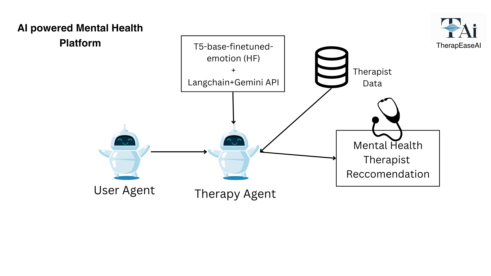
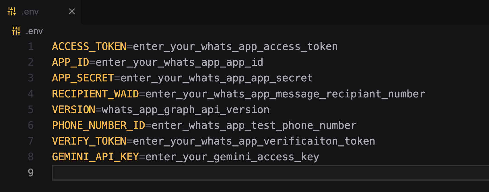

## TherapEaseAI



### ❖ Overview

This project is is part of the Fetch.ai hackathon submission at NIT Goa. We were given a Hugging Face model - [*t5-base-finetuned-emotion*](https://huggingface.co/mrm8488/t5-base-finetuned-emotion) (text-to-text model) to use the model to detect emotions in conversations.

### 🏆 Our Goal

We aimed to make use of the given Hugging Face Model for Emotion Recognition combined with Gemini API to build a mental health therapy platform. This platform is powered by two micro-agents implemented using the the uagents library.

### 🔗 Content

* [Overview](#-overview)
* [Content](#-content)
* [Team](#-team)
* [Features](#-features)
* [Tech Stack](#-tech-stack)
* [Environment Variables](#-environment-variables)
* [Run Locally](#-run-locally)
* [Documentation](#-documentation)
* [Demo](#-demo)
* [Screen-Shots](#-screen-shots)
* [Author](#-author)

### 👨‍👦‍👦 Team

- `Pratham Shankhwalker` -  *Python* - [LinkedIn](https://www.linkedin.com/in/pratham-shankwalker-ab2899205/), [GitHub](https://github.com/prathamshankwalker), [Instagram](https://www.instagram.com/prathamshankwalker/)  -  Machine Learning (ML) Developer

- `Atharva Parkhe` -  *Python* -   [LinkedIn](https://www.linkedin.com/in/atharva-parkhe-3283b2202/), [GitHub](https://github.com/atharvparkhe), [Instagram](https://www.instagram.com/atharvparkhe/) - Backend Developer

- `Madem Greeshma` -  *JavaScript* - [LinkedIn](https://www.linkedin.com/in/m-greeshma/), [GitHub](https://github.com/Greeshma2903), [Instagram](https://www.instagram.com/prathamshankwalker/)  -  Frontend Developer


### 📋 Features

- **USER'S Mental Health Assessment :** We are analysing our user's mental health dynamically while he/she is chatting with our AI Agent. After a conversation we give a detailed mental health assessment report to the user based on the detected emotions and problems.

- **Mental Health Therapist Reccomendation :** If the user's assessment report shows signs of depression, anxiety or any other mental health issues that are SEVERE then we reccomend top 5 mental health therapists based on user's location.

- **Mental Health Resources :** We provide a list of mental health resources like helplines, websites,videos and support groups to the user based on their location for users having MILD symptoms. 

- **Dedicated WhatsApp Bot :** We have also built the same AI Chatbot on WhatsApp platform using the WhatApp Cloud APIs and Custom Webhooks. So users can also chat with our AI therapist on WhatsApp for 24/7 support.


### 🧰 Tech Stack

- **`Libraries Used`** : Uagents, Flask, Langchain, Google-generativeai,transformers *(Python)*


### 🔐 Environment Variables

To run this project, you will need to add the following environment variables to your **.env** file

- `EMAIL_ID`  -  Email ID (which would be used to send emails)

- `EMAIL_PW`  -  Email Password

- `PUBLIC_KEY` - Razorpay API Public Key

- `PRIVATE_KEY` - Razorpay API Private Key




### 💻 Run Locally

***Step#1 : Clone Project Repository***

```bash
git clone https://github.com/atharvparkhe/sweet-mart.git && cd sweet-mart
```

***Step#2 : Create Virtual Environment***

* If *virtualenv* is not istalled :
```bash
pip install virtualenv && virtualenv env
```
* **In Windows :**
```bash
env/Scripts/activate
```
* **In Linux or MacOS :**
```bash
source env/bin/activate
```

***Step#3 : Install Dependencies***

```bash
pip install --upgrade pip -r requirements.txt
```

***Step#4 : Add .env file***

- ENV file contents
    - **In Windows :**
    ```bash
        copy .env.example .env
    ```
    - **In Linux or MacOS :**
    ```bash
        cp .env.example .env
    ```
- Enter Your Credentials in the *".env"* file. Refer [Environment Variables](#-environment-variables)

***Step#5 : Run Server***

```bash
python manage.py runserver
```

- Open `http://127.0.0.1:8000/` or `http://localhost:8000/` on your browser.

*Check the terminal if any error.*


### 📄 Documentation

The docs folder contain all the project documentations and screenshots of the project.

**Local Server Base Link :** http://localhost:8000/

**Ngroc Server Link (Not Permament) :** https://accurately-frank-wombat.ngrok-free.app


### 🧑🏻‍💻 Demo

YouTube Link : 
